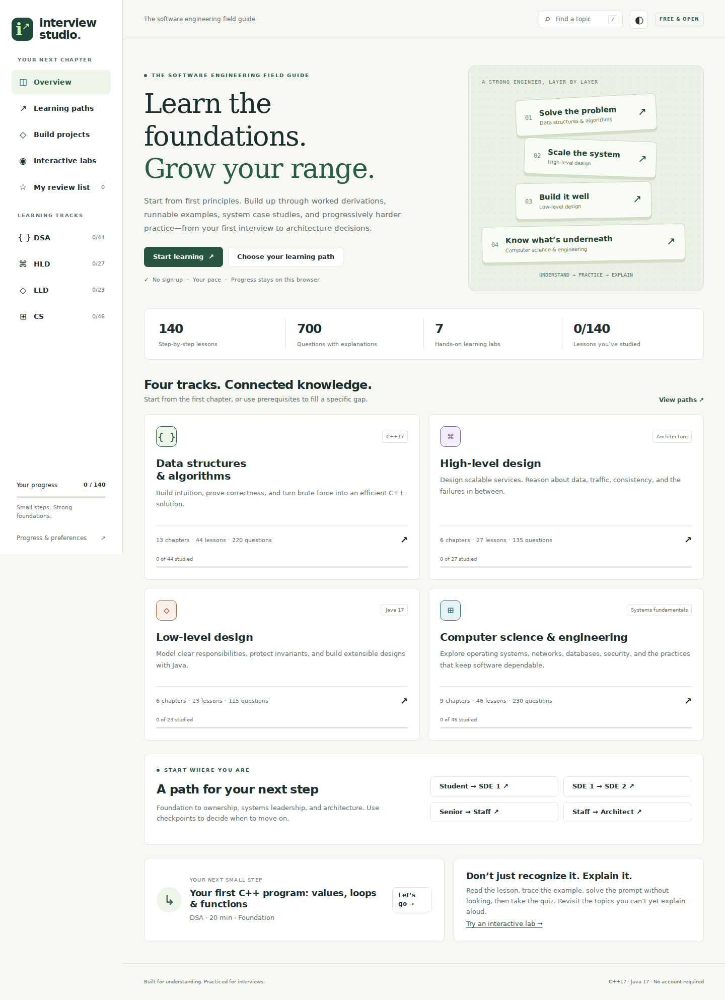

# Interview Studio

A free, public software-engineering learning site with paths from student and SDE 1 through SDE 2, senior/staff, and architect. **DSA uses C++17. LLD uses Java 17.** The application itself is plain HTML, CSS, and JavaScript, with no build step, backend, API key, or visitor login.



## Start in 30 seconds

Unzip the download. Open `index.html` in a modern browser. All lessons, quizzes, and labs are bundled locally. For the most predictable local storage, clipboard, and download behavior, serve the folder:

```sh
node serve.cjs
```

Open `http://127.0.0.1:4173/`. Node is optional for local preview and unnecessary on your hosting platform. The lesson examples are read/copy/download examples, not a browser-based C++ or Java compiler.

## Publish free on GitHub Pages

1. Create a **public** GitHub repository, such as `interview-studio`.
2. Upload the **contents of the extracted folder**, with `index.html` and `assets/` at the repository root. Upload the files, not the ZIP itself.
3. Commit to `main`.
4. In repository **Settings → Pages**, choose **Deploy from a branch**, then **main** and **/(root)**. Save.
5. Wait for the deployment, then open the URL shown there, typically `https://YOUR-USERNAME.github.io/interview-studio/`.

The owner needs a GitHub account to publish. **Visitors do not need an account.** GitHub Pages supports public repositories on GitHub Free, subject to its published limits. All asset links are relative and navigation uses hash routes, so project subpaths and lesson-link refreshes work without rewrite rules.

Official references: [Create a Pages site](https://docs.github.com/en/pages/getting-started-with-github-pages/creating-a-github-pages-site) · [Choose the publishing source](https://docs.github.com/en/pages/getting-started-with-github-pages/configuring-a-publishing-source-for-your-github-pages-site). Hosting instructions checked September 17, 2026.

For other static hosts, publish this folder with **no build command** and the repository root as the output directory. No server runtime is needed. Check the host’s current free-plan terms before deploying.

### If the hosted site is blank or returns 404

- Confirm `index.html` is at the selected publishing root, not inside another nested folder.
- Confirm `assets/app.js`, `assets/curriculum.js`, and `assets/styles.css` were uploaded with exact lowercase names.
- Check the Pages deployment status and allow time for publication.
- Use the exact URL from Pages settings. A project site normally includes the repository name.
- Refresh after deployment. This project has no service worker that can pin old content.

## What’s included

| Track | Lessons | Quiz questions | Examples |
|---|---:|---:|---|
| DSA | 44 | 220 | C++17, downloadable `.cpp` examples |
| High-level design & architecture | 27 | 135 | APIs, data flows, distributed failure scenarios |
| Low-level design | 23 | 115 | Java 17 examples and explicitly labeled design sketches |
| CS & engineering | 46 | 230 | OS, networks, databases, security, engineering practice |
| Total | **140** | **700** | A visual model, worked example, practice prompt, and quiz for every lesson |

The courses are organized into **34 ordered chapters**. Every lesson has a beginner introduction, three defined terms, a deeper reasoning section, three progressively harder exercises with separate hints and explained answers, learning objectives, prerequisite links, three conceptual explanations, a bundled SVG visual, a worked example, code or a design sketch, a three-step interactive walkthrough, a comparison table, pitfalls, a practice ladder with saved checkmarks, and five questions with answer explanations. Diagrams can be viewed full size, including on mobile. Some connected lessons share a companion model; the collection includes technical diagrams, numeric traces, and illustrated walkthroughs.

The UI includes:

- Track navigation and previous/next lesson buttons, including across track boundaries.
- Search across lesson titles, summaries, concepts, and pitfalls; press `/` to open search.
- Filters by topic, chapter, level, and studied status; collapsible chapters and a lesson-jump menu.
- Studied checkmarks, bookmarks, private browser-local notes, latest quiz results, and best scores.
- A review list for saved topics and latest imperfect quiz attempts.
- Four role-based learning paths with demonstrable checkpoints; together they cover all 140 lessons.
- Four capstone projects with persisted checklists, failure scenarios, and review rubrics.
- Seven interactive labs: Big-O growth comparison, binary search, capacity estimation, LRU caching, CPU scheduling, FIFO/LRU page replacement, and TCP message framing.
- Light/dark themes, mobile navigation, keyboard controls, reduced-motion support, and print styles.
- Progress export/import in JSON. Import asks before replacing existing progress.

## Progress and privacy

Progress uses schema version 2, stored under the retained key `interview-studio-v1` in `localStorage`. It is specific to the browser profile and site origin. It does **not** sync through GitHub or any server. Use **Progress & preferences → Export progress** to back up or move devices.

Clearing browser data, private browsing, changing origin, or browser storage restrictions may affect persistence. If saving fails, the app retains in-memory state and shows a warning so you can export it. Notes are rendered as text, not executable HTML. Imports are size-limited and validated against known lesson IDs.

There are no analytics, external fonts, CDN dependencies, login flows, or remote code execution. Outbound learning-resource links load third-party sites only when followed. Your web host may keep ordinary access logs.

Study checkmarks and quiz scores are separate. A 5/5 quiz checks recall; project evidence and explanation matter more than checking boxes.

### Upgrading from edition 2

Deploy to the same origin to preserve your existing notes, studied flags, bookmarks, and quiz scores. The original 95 lesson IDs and all five quiz questions per lesson retain their identity and order. This edition adds an optional `practiceChecks` field within the existing version-2 progress format. Export a backup before updating.

### Upgrading from edition 1

Replace the deployed source files with this edition, keeping the same hosting origin. Existing lesson IDs and the storage key remain stable. Notes, bookmarks, study status, and theme are preserved. Previous three-question scores appear as **Previous edition** results; the new five-question quizzes begin unattempted. Both version 1 and version 2 JSON backups can be imported. Export a backup before replacing a deployment. If you move to a different origin/device, import your backup there.

## Curriculum

**DSA:** first programs, arrays/strings, Big-O derivation, best/worst/average/amortized analysis, recurrences, C++/STL/recursion, complexity, hashing/prefix sums, two pointers, sliding windows, binary search, sorting, linked lists, stacks, trees/BSTs, heaps, tries, BFS/DFS, topological sorting, shortest paths, union-find, backtracking, DP, greedy, bits, KMP string matching, Fenwick trees, advanced sequence DP, strongly connected components, modular arithmetic, Kadane, merge sort, quickselect, Floyd cycle entry, monotonic deques, MSTs, edit distance, and segment trees.

**HLD & architecture:** requests and services from zero, API contracts, load balancing, consistent hashing, blob storage, payment correctness, design method, capacity, APIs/load balancing, storage, caching, replication/sharding, consistency/consensus, queues, reliability, URL shortener, rate limiter, chat, feed, domain boundaries, sagas/CQRS, stream processing, multi-region designs, migrations, ADRs/quality attributes/governance, cost/performance, and search platforms.

**LLD:** OOP from zero, inheritance/polymorphism, UML relationships, an interview delivery method, in-memory filesystems, board-game state machines, modeling, SOLID/composition, strategy/factory, observer/decorator, state machines, concurrency/idempotency, LRU, parking, elevator, expense sharing, booking/payments, testing, Java object contracts, aggregates, hexagonal architecture, pattern selection, and job schedulers.

**CS:** OOP runtime, IPC, semaphores, Banker’s safety algorithm, allocation, disk scheduling, SQL joins/aggregation/window functions, locking, NoSQL, subnetting, link-layer delivery, TCP lifecycle, application protocols, network diagnosis; computer architecture, memory models, compilation; processes/threads, scheduling, synchronization, deadlocks, virtual memory, filesystems, I/O; network layers, DNS, TCP/UDP/QUIC, HTTP, TLS, routing; SQL/relational models, normalization, indexes, isolation, recovery; threat modeling, authentication/authorization, cryptography, web security; Git, testing, delivery, containers, observability, debugging.

See [the full topic index](docs/CURRICULUM.md) for all lessons, prerequisites, and modules.

The paths organize preparation by scope, not a universal job-level standard. This is a broad core curriculum rather than an exhaustive treatment of every software specialty. It does not provide full specialist courses in ML, graphics, mobile development, formal verification, or vendor certification. Capstones are briefs to implement independently; sketches are educational contracts, not production services. Pair study with implementation, primary references, feedback, and timed practice.

## Project structure

- `index.html` — accessible application shell.
- `assets/styles.css` — responsive visual system and themes.
- `assets/app.js` — navigation, quizzes, persistence, search, and labs.
- `assets/curriculum.js` — all lesson and quiz content; edit this to extend the curriculum.
- `assets/course-outline.js` — ordered chapters and their lesson IDs.
- `assets/learning-paths.js` — role milestones and capstone briefs.
- `assets/diagrams/` — 140 bundled, editable SVG assets; no image CDN.
- `docs/CURRICULUM.md` — full topic index.
- `assets/favicon.svg` — original vector mark.
- `examples/dsa/` — the exact C++17 snippets shown in DSA lessons; add a `main()` or use the test harness.
- `examples/java/DesignExamples.java` — seven compilable Java example groups. Conceptual case-study sketches are intentionally not included as complete applications.
- `examples/java/chapters/` — six additional compilable examples, including a working in-memory filesystem and fixed-size game.
- `tests/` — content checks, C++ behavioral tests, Java checks, and browser scenarios.
- `serve.cjs` — optional dependency-free local HTTP preview.
- `.nojekyll` — static publishing marker for GitHub Pages.

## Extend a lesson

Edit the matching object in `assets/curriculum.js`. Keep a unique stable `id` to preserve saved progress. Each `quiz` item contains `prompt`, three `options`, zero-based `answer`, and `explanation`. `concepts` and `walkthrough` hold heading/body pairs; `comparison` holds approach/benefit/limitation triples. `prerequisites` lists existing IDs and must remain acyclic. `visual` supplies a local SVG path, title, descriptive alt text, and caption.

`teaching` contains `intro`, three `terms`, deeper heading/body pairs in `advanced`, and three `drills` with `level`, `prompt`, `hint`, and `answer`. Add the lesson to `assets/course-outline.js` and keep `chapter` and `module` aligned.

Update the matching `.cpp` file when changing a DSA snippet. Update `assets/learning-paths.js` when adding topics or changing prerequisites, and update fixed counts in docs and tests. Quiz answers are saved by option index: if you reorder questions/options or change answers, add an explicit migration/reset for affected results. Preserve the first three original questions if retaining edition-one legacy scores. The current site assumes five questions per lesson and three guided steps; update the UI text and validation when changing that contract.

## Run checks

Content validation needs Node:

```sh
node tests/content.cjs
```

C++ behavioral tests need `g++` with C++17 and UndefinedBehaviorSanitizer support (or set `CXX` to a compatible compiler):

```sh
node tests/dsa.cjs
```

Java tests need JDK 17 or later:

```sh
javac -d .test-output/java examples/java/DesignExamples.java examples/java/chapters/*.java tests/DesignExamplesTest.java tests/ChapterExamplesTest.java
java -ea -cp .test-output/java DesignExamplesTest
java -ea -cp .test-output/java ChapterExamplesTest
```

Optional browser tests need development dependencies and Chromium; these are **not** needed to host the website:

```sh
npm install
npx playwright install chromium
npm run test:browser
```

See `TESTING.md` for executed checks and scope.

## Course structure and inspiration

Edition 3 responds to the gap between revision notes and learning a subject from scratch: prerequisites and chapter order come first; examples explain the derivation before exercises ask for transfer. See [the reference-to-curriculum map](docs/COURSE-DESIGN.md) for how the requested inspirations informed this structure. All explanations, exercises, code, and SVGs are original. This is an independent core curriculum, not a reproduction of those courses.

## Learning references

Lessons and examples are original explanations; references are for further study and verification, not copied course material.

- [MIT 6.006 course notes](https://ocw.mit.edu/courses/6-006-introduction-to-algorithms-spring-2020/pages/lecture-notes/) — algorithms and proofs.
- [C++ working draft: sorting](https://eel.is/c++draft/alg.sort) — library contracts (the draft also includes newer features beyond our C++17 examples).
- [Oracle Java interfaces](https://docs.oracle.com/javase/tutorial/java/IandI/) — interface/inheritance fundamentals; the older tutorial predates some Java 17 features.
- [Java 17 LinkedHashMap](https://docs.oracle.com/en/java/javase/17/docs/api/java.base/java/util/LinkedHashMap.html) and [ConcurrentHashMap](https://docs.oracle.com/en/java/javase/17/docs/api/java.base/java/util/concurrent/ConcurrentHashMap.html) — API contracts for the examples.
- [PostgreSQL transaction isolation](https://www.postgresql.org/docs/current/transaction-iso.html) — product-specific isolation behavior.
- [AWS Builders’ Library](https://aws.amazon.com/builders-library/) — distributed systems engineering.
- [Timeouts, retries, and jitter](https://aws.amazon.com/builders-library/timeouts-retries-and-backoff-with-jitter/) — failure-handling considerations.
- [Raft](https://raft.github.io/) — consensus paper and visualization.
- [Operating Systems: Three Easy Pieces](https://pages.cs.wisc.edu/~remzi/OSTEP/) — OS concepts and exercises.
- [RFC 9110](https://www.rfc-editor.org/rfc/rfc9110) — HTTP semantics.
- [OWASP Cheat Sheet Series](https://cheatsheetseries.owasp.org/) — practical security guidance.
- [Google SRE books](https://sre.google/books/) — reliability practices.
- [OpenTelemetry concepts](https://opentelemetry.io/docs/concepts/) — telemetry signals and context.

## License

The original site code and educational content are provided under the MIT license in `LICENSE`. Referenced third-party pages retain their own licenses. All bundled SVG diagrams are original; no third-party images or fonts are included.
